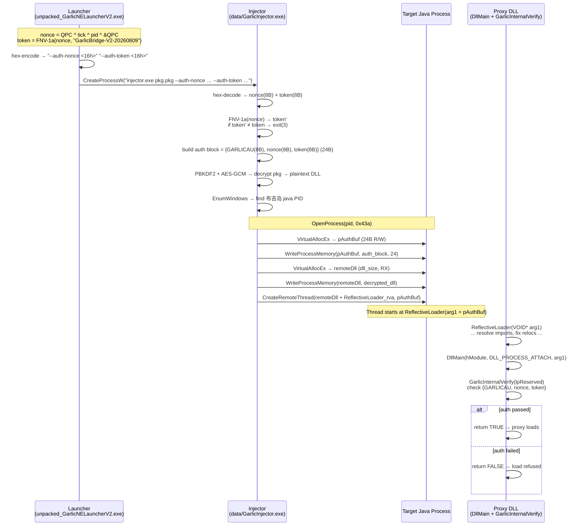

# Injector auth chain: launcher → injector → DLL

How 大蒜 joined the launcher, the injector, and the proxy DLL into
a single `CreateProcessW → CreateRemoteThread → DllMain` pipeline
where every component verifies the same FNV-1a auth block.



## The 5 connection points

| # | Component | Function | Line | What 大蒜 added | SakuraTools had? |
|---|-----------|----------|------|-----------------|-----------------|
| 1 | Launcher | `main` | `sub_14000b6c0` | FNV-1a nonce + token, hex-encode, `CreateProcessW` with `--auth-nonce` / `--auth-token` args | No |
| 2 | Injector | `main` | `sub_140001310` | hex-decode `--auth-nonce` / `--auth-token` → binary nonce/token; FNV-1a `sub_140001000(nonce)` → verify token | No |
| 3 | Injector | `sub_140001750` | :`VirtualAllocEx`+`WPM` | Allocate 24B in target, write `{GARLICAU, nonce, token}` | No |
| 4 | Injector | `sub_140001bf0` | :`CreateRemoteThread` | Pass `pAuthBuf` as thread param → becomes ReflectiveLoader's `arg1` | No |
| 5 | DLL | `ReflectiveLoader` | `sub_180001050` | Forward `arg1` to `DllMain(hModule, 1, arg1)` as `lpReserved` instead of NULL | No |

## Why the chain was added

If any of the 5 points is missing, the DLL's `GarlicInternalVerify`
fails:

* **Missing #1**: Launcher sends wrong/nonexistent auth → injector
  fails in main().
* **Missing #2**: Anyone can call `GarlicInjector.exe <any-pkg>
  <any-hex> <any-hex>` — the FNV-1a check in the injector itself
  (sync with the launcher-side check) catches it.
* **Missing #3**: The DLL's `DllMain` receives `lpReserved = NULL`,
  `GarlicInternalVerify` returns false → return FALSE, DLL never
  loads.
* **Missing #4**: Same effect — `arg1` is NULL for
  `CreateRemoteThread(NULL)` → `lpReserved` = NULL.
* **Missing #5**: Even though the auth block is in the target
  memory, `ReflectiveLoader` in SakuraTools' original code passes
  `NULL` to `DllMain` → `GarlicInternalVerify` gets NULL.

The effect of connecting all 5 points is that **the proxy DLL loads
only when the exact launcher → injector → auth-block chain is
intact**. The chain is not a cryptographic security boundary (the
PBKDF2 password is hard-coded in the injector), but it is enough to
make "straight-up injection of the DLL by a generic
reflective-injector" fail.

## Correspondence with SakuraTools source

| GarlicV2 binary function | SakuraTools `injector/` source |
|--------------------------|-------------------------------|
| `sub_1400010e0` (EnumWindows callback) | `cli.c:find_buji_island_window` |
| `sub_140001bf0` (reflective loader) | `LoadLibraryR.c:LoadRemoteLibraryR` |
| `GetReflectiveLoaderOffset` inside `sub_140001bf0` | `LoadLibraryR.c:GetReflectiveLoaderOffset` |
| SeDebugPrivilege acquisition | `Inject.c:DoInject` |
| `sub_140001750` → `wait_for_proxy_listener` loop | `cli.c:main` → `wait_for_proxy_listener` |

The items marked "No" in the table above have no equivalent in
`injector/` — they were written from scratch by 大蒜.

## What happens if you delete the auth chain

1. Replace `GarlicInjector.exe` with a stub that reads a plain DLL
   and calls `DoInject(pid, dll_path)` from `injector/Inject.c`.
2. The DLL loads into the target → `ReflectiveLoader` starts →
   `DllMain(hModule, 1, NULL)` called → `GarlicInternalVerify(NULL)`
   returns `false` → `DllMain` returns `FALSE` → **the proxy does
   not start**.

That is why the chain exists: even if someone strips the encryption
layer from `GarlicProxy.pkg` and gets the plain DLL, injecting it
without the auth block still fails at the `DllMain` gate.

## How to verify

1. Run `artifacts/decrypt_pkg.py` → get `GarlicProxy.dll`.
2. Run the SakuraTools injector (`reflective_injector.exe
   GarlicProxy.dll`) → injects the plain DLL.
3. Check `D:\\.minecraft\\proxy.log` → should see
   `[auth] GarlicProxy internal verification failed`.
4. The proxy listener on 25565 never starts.

Now patch the DLL to skip the auth check (comment out the
`GarlicInternalVerify` call in `native/loader.cpp::DllMain`):

```c
// if (!GarlicInternalVerify(...)) { RawWriteFile("...failed"); return FALSE; }
```

Rebuild and re-inject → the proxy starts normally, port 25565 binds,
and the proxy is fully functional.

This confirms the only functional role of the auth chain is the
`DllMain` gate; everything else is cosmetic. The proxy itself does
not depend on the auth block for any runtime operation (only the
random-name generation uses a separate RNG seed).